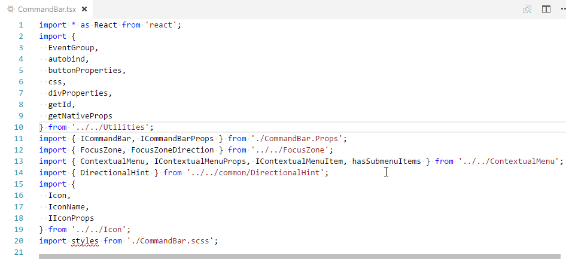

## ⚠  This package is no longer maintained ⚠
With the release of [Typescript 2.8](https://devblogs.microsoft.com/typescript/announcing-typescript-2-8-2/#organize-imports) over a year ago, the ability to organize imports comes bundled with Typescript, in a better implementation than this one made for a hack week. As such, I have no further plans to maintain this project.

If for whatever reason you would like to take ownership of this repository, please let me know.

# Sort Typescript imports

Sort import statements in Typescript code

## Features

This configurable extension allows you to sort all the imports in a *.ts or *.tsx file.

> Tip: You can access this functionality either from the context menu, or simply pressing 'F10'

## Extension Settings

* `typescript.extension.sortImports.sortMethod`: The method to use for sorting the imports.
  * `'importName'`(default) sorts by the type and name of the import. Namespace imports are first, followed by default imports, named imports, and unnamed imports.
  * `'path'` sorts by the import path, sorting relative-path imports above package imports
* `typescript.extension.sortImports.pathSortOrder`: An array describing the order in which imports should be sorted by paths. Only applicable if `sortMethod` is set to `path`.
  * Default: `["relativeDownLevel", "relativeUpLevel", "package"]`
  * `package` - Any import path that does not begin with `.`
  * `relativeUpLevel` - Any import path that begins with `../`
  * `relativeDownLevel` - Any import path that begins with `./`
* `typescript.extension.sortImports.maxNamedImportsInSingleLine`: The number of named imports to allow on a single line. If a single import has more than this number, they will be broken up onto separate lines.
* `typescript.extension.sortImports.quoteStyle`: The type of quotation mark to use. `single`(default) or `double`.
* `typescript.extension.sortImports.sortOnSave`: If set to `true`, imports will be sorted whenever you save a file. Default: `false`
* `typescript.extension.sortImports.omitSemicolon`: If set to `true`, the trailing semicolon will be omitted. Default: `false`
* `typescript.extension.sortImports.enableJavascript`: If set to `true`, the extension will attempt to sort ES6-style imports in Javascript files. Default: `false`

## Known Issues

* This extension does not currently sort comments within the import block along with the import statements

## Future roadmap
- Handle distinct blocks of imports separated by a blank line.
- Handle comments within import blocks
- Read settings from existing tslint configuration.

## Release Notes

## 1.3.0
- Added configuration option to omit the semicolon at the end of the import clause.

### 1.2.0
- Added the ability to configure how sorting by import path is done.

### 1.1.0
- Added the option to sort imports whenever you save, controlled by the `typescript.extension.sortImports.sortOnSave` setting (`false` by default).

### 1.0.0

Initial release
